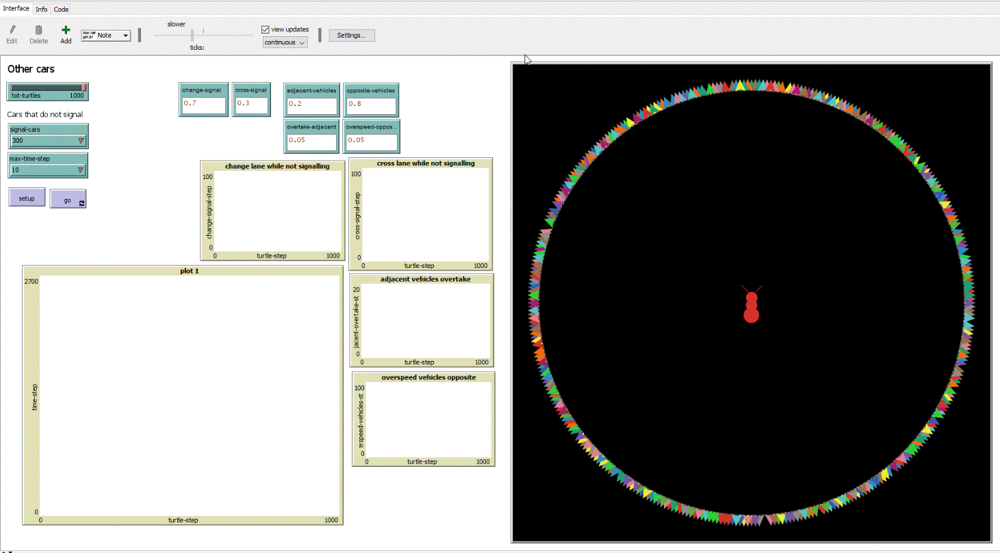
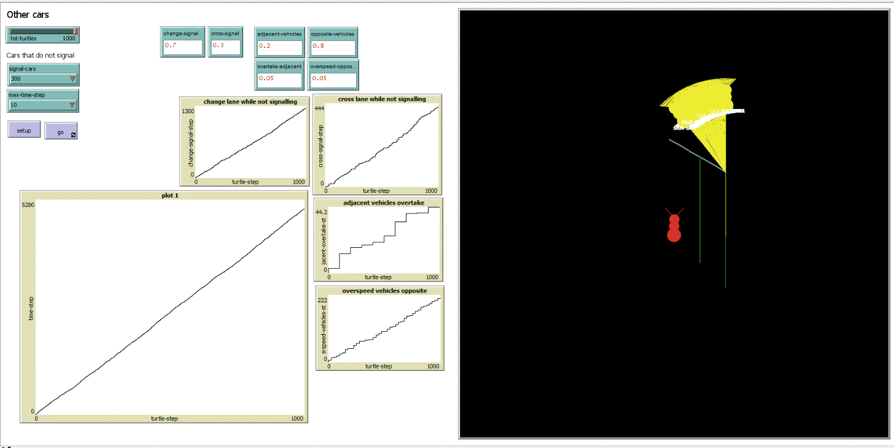
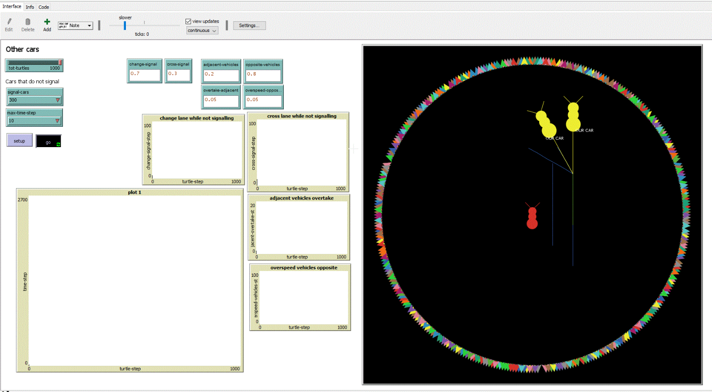

CONTEXTUALLY SELF ORGANISING MAPS
---------------------------------

Driving Risks are observed in every day life. Driving has been **hazardous** due to the incidents that could happen to us while making a small mistake. Driving is a matter where **risk awareness** prevails, due to which business continuity and risk management must be touched. 

Driving is a fact under general tasks where **risk adherence** is part of performing well at driving. 

In the light of several exercises regarding complexity management or complexity science, a Netlogo simulation has been performed which explains the nature of driving mistakes seen.

Conceptual Data Model
---------------------

|	Observation |	Assimilation | Inference	| Frames per second |
|-----|-------|--------|--------|
| Objects	|		|	   |    |
| Texts		|		|	   |    |			
| Number Plates	|		|	   |    |			
| Journey		|		|	   |    |			
| Landmarks	|		|	   |    |

The rows data are the scenes that the driver may be into
The columns data are the scenes that the driver learns from various risks and non-risks

There is a third dimension which are about:
- Risk Hazard
- Risk Awareness
- Risk Adherence

Netlogo Simulation
------------------

### Initial Setup of simulation

### Detailing of final stage of simulation

### Intermediary stages of simulation

